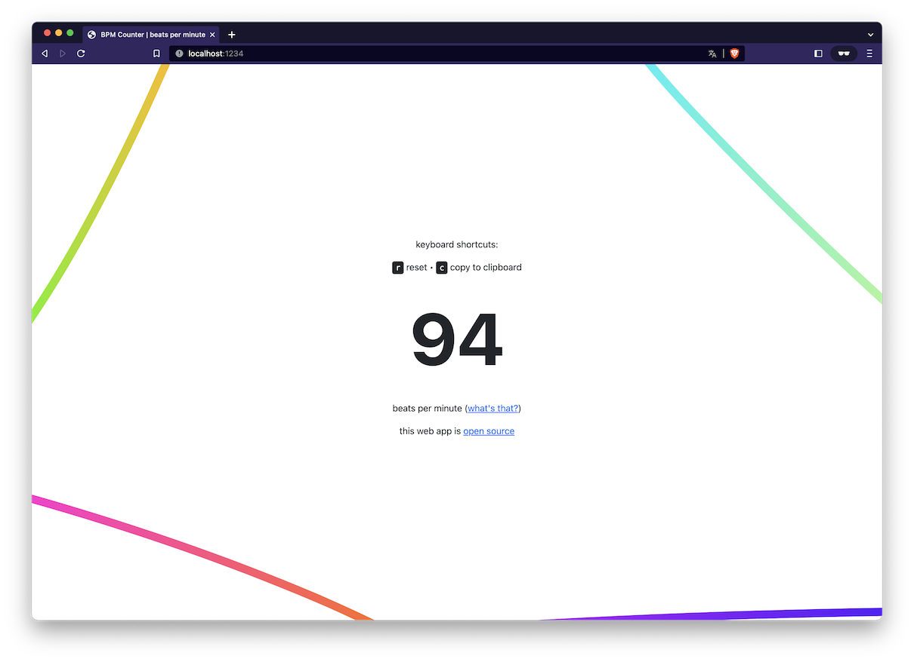

<h1 align="center">BPM Counter</h1>
<p align="center">Minimalistic web app to count beats per minute using clicks</p>

<br>

<p align="center">
    <a href="https://github.com/jarne/bpm-counter/blob/master/package.json">
        
    </a>
    <a href="https://app.netlify.com/sites/clever-dijkstra-9bf79e/deploys">
        
    </a>
    <a href="https://github.com/jarne/bpm-counter/blob/master/LICENSE">
        
    </a>
</p>

##

[• Description](#-description)  
[• Usage](#-usage)  
[• Contribution](#-contribution)  
[• License](#%EF%B8%8F-license)

## 📙 Description

This is a very simple BPM Counter app to get the beats per minute by tapping any key on your keyboard. It provides keyboard shortcuts for resetting or copying the BPM value to the clipboard.

Here's a screenshot of the web app:



## 🖥 Usage

### Simply way (hosted version)

Use the hosted version at ...

### Self-install (local)

Clone the repository and install the dependencies using:

```
$ yarn install
```

Then run this command to build the web app:

```
$ yarn build
```

The built website will be available in the `dist`-folder, just open the `index.html`-file in your browser or upload the files to a web server.

## 🙋‍ Contribution

Contributions are always very welcome! It's completely equally if you're a beginner or a more experienced developer.

Thanks for your interest 🎉👍!

## 👨‍⚖️ License

[MIT](https://github.com/jarne/bpm-counter/blob/main/LICENSE)
